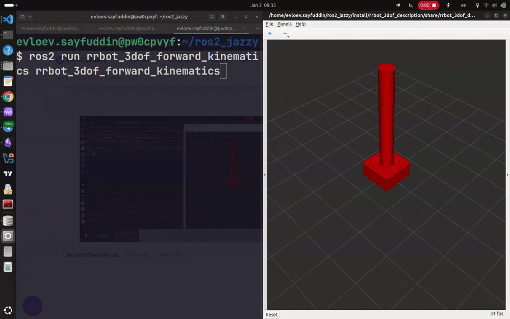

# 3 DOF robot arm forward and inverse kinematics
This repo provides the solution of forward and inverse kinematics of a 3 DOF
robot arm. The forward kinematics is solved using the geometrical method, the inverse
kinematics is solved using the numerical method.

## Forward kinematics
The forward kinematics task requires to find the end effector XYZ coordinates for
the given changes in joints.


## Inverse kinematics
The inverse kinematics task requires to find the changes in the joints
so the end effector will get to the given XYZ coordinates.


## Usage
The forward and inverse kinematics are solved in realtime all the time durring robot
control. Solving the forward kinematics lets the robot know where he is currently in space. While solving the inverse kinematics lets him know how to reach a given point in space.


## Launch demo
```bash
# ROS workdir init
source /opt/ros/<ros-distribution>/setup.bash
cd ~
mkdir -p ros2_ws/src
cd ros2_ws
colcon build
source install/setup.bash
# Clone
cd src
git clone <repo-url>
cd ..
# Build
colcon build --packages-select rrbot_3dof_description rrbot_3dof_bringup rrbot_3dof_forward_kinematics rrbot_3dof_inverse_kinematics
```
In 3 separate terminals execute the following commands
```
# Start ROS/RViz and robot controllers
cd ~/ros2_ws
source install/setup.bash
ros2 launch rrbot_3dof_bringup robot.launch.py
```
```
# Start FK node
cd ~/ros2_ws
source install/setup.bash
ros2 run rrbot_3dof_forward_kinematics rrbot_3dof_forward_kinematics
```
```
# Start IK node
cd ~/ros2_ws
source install/setup.bash
ros2 run rrbot_3dof_inverse_kinematics rrbot_3dof_inverse_kinematics
```
